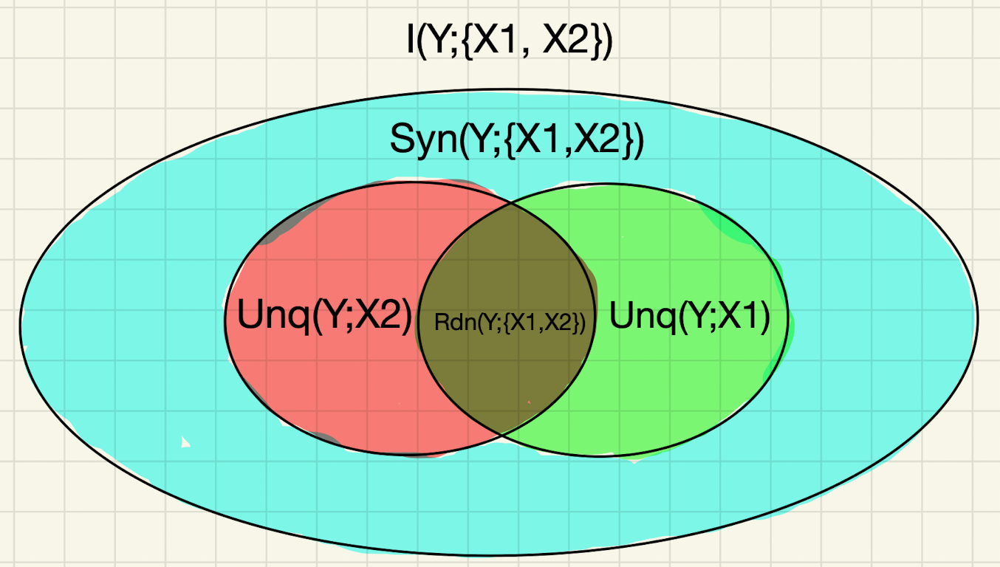

# Eye Gaze Interaction Project

This repository contains scripts and notes for an independent analysis of an eye-gaze interaction dataset. The project focuses on using information-theoretic methods, especially transfer entropy and partial information decomposition, to study how head and eye movement relate to task performance under degraded gaze-interaction conditions.

# Project Motivation

The original dataset involves participants completing target-selection trials under different layouts and tracking modes. Some tracking modes degrade the interaction signal through bias and jitter. This creates a useful setting for asking whether head and eye movement contain meaningful information about task performance, or whether apparent relationships are partly driven by artifacts such as sample length, noise, and time dependence.

The main goal of this project is to replicate and extend transfer entropy-style results using the IDTxl Python package.

# Research Questions

The project is currently organized around the following questions:

> Do head and eye movement show directional temporal coupling during gaze-interaction tasks?

>Are transfer entropy measures associated with task performance under degraded interaction conditions?

>Do these relationships remain after accounting for sample length and shuffled-baseline corrections?

>Can partial information decomposition help separate unique, redundant, and synergistic contributions from head and eye movement?


# Tools
The main Python package used for information-theoretic analysis is:

>IDTxl

>https://github.com/pwollstadt/IDTxl

# Dataset Structure

The original dataset is expected to include frame-level and trial-level data. The relevant analysis unit is generally:

participant × layout × tracking mode

Within each condition block, participants completed target-selection trials. Frame-level analyses focus on periods where the trial state is active.

The data are not included directly in this repository unless otherwise stated.


This project is exploratory. Transfer entropy results should be interpreted carefully, especially when raw TE relationships weaken after shuffled-baseline correction or sample-length controls. The goal is not only to estimate information flow, but also to understand which parts of the signal reflect meaningful behavioural structure and which parts may reflect statistical artifacts.

## Key Concepts

### Transfer Entropy

Transfer entropy is an information-theoretic measure of directional prediction between two time series.

In simple terms, transfer entropy asks whether the past of one signal helps predict the current or future state of another signal, above and beyond what that second signal’s own past already predicts.

The output of a transfer entropy analysis is usually a non-negative information value, often measured in bits or nats depending on the estimator. A larger transfer entropy value means that the past of the source signal provides more information about the target signal, after accounting for the target signal’s own past. A value close to zero means that the source signal adds little or no predictive information under the model being used.

However, the raw transfer entropy value is not enough by itself. It needs to be evaluated statistically and interpreted carefully. In IDTxl, this is usually done through permutation testing. The source signal is shuffled or resampled to create a baseline distribution of transfer entropy values that could appear by chance. The observed transfer entropy is then compared against this null distribution. If the observed value is larger than what would usually be expected under the shuffled baseline, the source may be selected as statistically significant.

A useful transfer entropy result should therefore be evaluated in several ways:

```text
1. Direction:
   Is the information flow stronger from eye -> head or from head -> eye?

2. Magnitude:
   How large is the transfer entropy value?

3. Statistical significance:
   Is the result significant?

4. Robustness:
   Does the result remain after controlling for sample length, autocorrelation, layout, tracking mode, or other confounds?

5. Interpretation:
   Does the result plausibly reflect behavioural coordination, or could it be driven by noises in the time series?
```

### Partial Information Decomposition

Partial information decomposition, or PID, is an information-theoretic framework for analyzing how multiple source variables provide information about a target variable. 

Rather than giving only a single total information value, PID separates the information into different components. **Unique information** is information provided by one source but not another. **Redundant information** is information that is shared by multiple sources. **Synergistic information** is information that only becomes available when the sources are considered together. In this way, PID helps describe whether information about a target is carried separately, shared across sources, or produced by the combination of sources.
